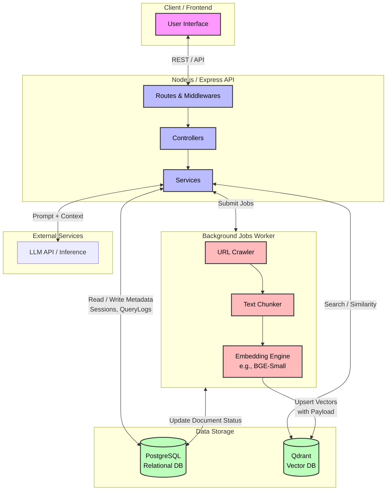

# URL RAG Backend - Architecture Diagram

This diagram visualizes the primary components and data flows of the URL RAG (Retrieval-Augmented Generation) Backend application based on its source code structure and database schema.

## System Components Explained

### 1. Node.js API (Backend)

- Handles incoming REST requests from clients.
- Manages authentication via `Sessions` and `Users`.
- Stores metadata of endpoints and user requests.

### 2. Relational Database (PostgreSQL via Prisma)

Stores structured application state and metadata:

- **`User`** & **`Session`**: User accounts and auth tokens.
- **`Document`**: Tracks uploaded URLs, crawling status (`PENDING`, `CRAWLING`, `EMBEDDING`, `INDEXED`), and metadata.
- **`Chunk`**: Stores the raw text chunks mapped to their vector ID.
- **`QueryLog`**: Historical cache of user questions, sources, LLM latency, and retrieval scores.
- **`UsageLog`**: Tracks usage and token costs for billing or monitoring.

### 3. Background Jobs / Pipeline

Handles the heavy lifting of ingestion asymptotically:

- **URL Crawling**: Fetches content from user-provided URLs.
- **Chunking**: Breaks text documents down into smaller segments without losing semantic context.
- **Embedding**: Converts text chunks into dense vector embeddings using an embedding model (e.g., `bge-small`).

### 4. Vector Database (Qdrant)

- Stores the generated high-dimensional space vectors for each document chunk.
- Allows semantic similarity searches based on user queries, matching the query vector to chunk vectors accurately.

### 5. LLM Integration

- The backend reconstructs context using retrieved chunks from Qdrant and sends them via prompt to the LLM.
- The generated response is returned to the user and saved for review in `QueryLog`.
